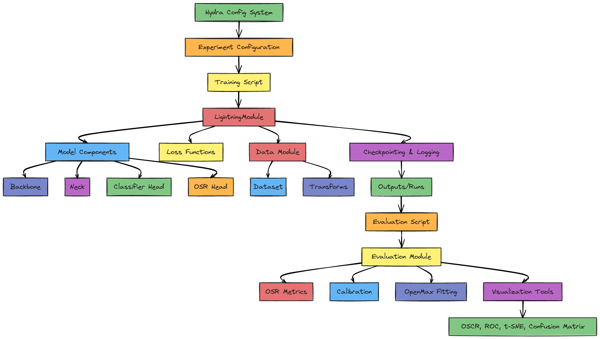

# Deep Open-Set Recognition (OSR) Framework

[](https://www.python.org/downloads/)
[](https://pytorch.org/)
[](https://www.pytorchlightning.ai/)
[](https://hydra.cc/)
[](LICENSE)
[](https://github.com/psf/black)

A comprehensive, modular, and highly configurable PyTorch Lightning framework for Open-Set Recognition (OSR) research and applications. This repository enables deep learning practitioners to easily train, evaluate, and benchmark OSR models in a standardized way.

> **Open-Set Recognition (OSR)**: The ability of a model to identify inputs from unknown classes not seen during training, while still correctly classifying known classes.

<div align="center">
  
</div>

## Features

- 🔍 **Modular Architecture**: Easily swap components (Backbone, Neck, Classifier Head, OSR Head)
- 🚀 **Multiple Backbones**: Support for ResNet, EfficientNet, Vision Transformers (ViT), and DINOv2
- 🧠 **OSR Strategies**: Energy-based detection, OpenMax, K+1 Softmax, and more
- ⚙️ **Hydra Configuration**: Fully configurable with YAML files for reproducible experiments
- 📊 **Comprehensive Evaluation**: Standardized metrics for OSR performance (AUROC, OSCR, etc.)
- 📈 **Visualization Tools**: Generate OSCR curves, ROC curves, t-SNE plots, and confusion matrices
- 🔄 **Extensible Design**: Easy to add new models, datasets, and OSR methods

## 📂 Project Structure

```
deep-osr/
├─ configs/         # Hydra configuration files
│  ├─ config.yaml     # Main configuration with defaults
│  ├─ dataset/        # Dataset-specific configs (CIFAR10, etc.)
│  ├─ model/          # Model architecture configs
│  ├─ train/          # Training hyperparameters
│  ├─ eval/           # Evaluation settings
│  └─ experiment/     # Complete experiment configurations
├─ data/            # Dataset storage (auto-downloaded)
│  └─ processed/      # Processed datasets
├─ src/             # Source code
│  ├─ deep_osr/       # Main package
│  │  ├─ data/          # Dataset and dataloader implementations
│  │  ├─ models/        # Model components (backbone, neck, heads)
│  │  ├─ losses/        # Loss function implementations
│  │  ├─ utils/         # Utilities (seeding, calibration)
│  │  ├─ visualize/     # Visualization tools
│  │  ├─ open_set_metrics.py # Metrics calculation
│  │  ├─ train_module.py     # PyTorch Lightning module
│  │  ├─ train.py            # Training entry point
│  │  └─ eval.py             # Evaluation entry point
│  └─ train_module.py   # Main training interface
├─ scripts/         # Utility scripts
│  ├─ run_train.sh     # Training script
│  ├─ run_eval.sh      # Evaluation script
│  ├─ gen_plots.sh     # Plot generation script
│  └─ sweep.yaml       # Hyperparameter sweep configuration
├─ tests/           # Unit and integration tests
├─ outputs/         # Experiment outputs
│  └─ runs/           # Individual experiment runs
│     └─ YYYY-MM-DD_HH-MM-SS/ # Timestamped run folders
└─ build/           # Build artifacts
```

## ⚙️ Installation

### Prerequisites

- Python 3.8+
- CUDA-compatible GPU (recommended)
- Git

### Method 1: Using pip

1. **Clone the repository:**
   ```bash
   git clone https://github.com/yourusername/deep-osr.git
   cd deep-osr
   ```

2. **Create a virtual environment:**
   ```bash
   # On Windows
   python -m venv venv
   venv\Scripts\activate

   # On Linux/Mac
   python -m venv venv
   source venv/bin/activate
   ```

3. **Install dependencies and package:**
   ```bash
   pip install -r requirements.txt
   pip install -e .
   ```

### Method 2: Using conda

1. **Clone the repository:**
   ```bash
   git clone https://github.com/yourusername/deep-osr.git
   cd deep-osr
   ```

2. **Create and activate conda environment:**
   ```bash
   conda create -n deep-osr python=3.10
   conda activate deep-osr
   ```

3. **Install PyTorch with CUDA (adjust version as needed):**
   ```bash
   conda install pytorch torchvision pytorch-cuda=11.8 -c pytorch -c nvidia
   ```

4. **Install remaining dependencies and package:**
   ```bash
   pip install -r requirements.txt
   pip install -e .
   ```

## 🚀 Quickstart

### Train a model with default settings (CIFAR10, ResNet50, Energy-based OSR)

```bash
# Windows
scripts\run_train.sh experiment/cifar10_resnet50_energy

# Linux/Mac
bash scripts/run_train.sh experiment/cifar10_resnet50_energy
```

### Evaluate the trained model and generate visualizations

```bash
# Replace with your actual run timestamp
$RUN_DIR="outputs/runs/2025-06-03_16-30-14"

# Evaluate
scripts\run_eval.sh $RUN_DIR

# Generate plots
scripts\gen_plots.sh $RUN_DIR

# See the results
explorer "$RUN_DIR\plots"  # on Windows
# open "$RUN_DIR/plots"    # on Mac
```

## 📊 Datasets

The framework is built to work with any image dataset, with CIFAR10 provided as an example. Datasets are configured in `configs/dataset/`.

### Included Dataset

**CIFAR10**: Automatically downloaded by `torchvision` to `data/processed/cifar10`.
- Default configuration (`configs/dataset/cifar10_8k_2u.yaml`): 
  - **Known classes (0-7)**: airplane, automobile, bird, cat, deer, dog, frog, horse
  - **Unknown classes (8-9)**: ship, truck
  
### Adding Your Own Dataset

1. Create a new dataset class in `src/deep_osr/data/`
2. Create a configuration file in `configs/dataset/`
3. Register your dataset in the datamodule factory

## 🔧 Working with the Framework

### Training Models

The training workflow is orchestrated through the `scripts/run_train.sh` script with experiment configurations:

```bash
scripts/run_train.sh experiment/cifar10_resnet50_energy
```

#### What happens during training:

1. The experiment configuration is loaded from `configs/experiment/cifar10_resnet50_energy.yaml`
2. Training begins using the PyTorch Lightning module in `src/deep_osr/train_module.py`
3. Model checkpoints, logs, and configs are saved to `outputs/runs/YYYY-MM-DD_HH-MM-SS/`
4. Temperature calibration is performed after training and saved as `calibration_info.json`
5. Basic metrics are logged to `train.log`

#### Customizing training:

Override any configuration parameter directly from the command line:

```bash
scripts/run_train.sh experiment/cifar10_resnet50_energy \
  train.trainer.max_epochs=10 \
  model.backbone.name=efficientnet_b4 \
  train.optimizer.lr=0.001
```

#### Hyperparameter sweeps:

Run multiple experiments with different settings using Hydra's multirun feature:

```bash
python -m src.deep_osr.train -m \
  model.backbone.name=resnet50,vit_b16 \
  model.osr_head.type=energy,kplus1 \
  +experiment=experiment/cifar10_resnet50_energy \
  train.trainer.max_epochs=5
```

For advanced sweep configurations, see `scripts/sweep.yaml`.

### Evaluating Models

After training, evaluate the model using `scripts/run_eval.sh`:

```bash
scripts/run_eval.sh outputs/runs/YYYY-MM-DD_HH-MM-SS
```

#### What happens during evaluation:

1. The best checkpoint and configuration are loaded from the training run
2. If using OpenMax, Mean Activation Vector (MAV) fitting is performed
3. Calibration temperature is applied if available
4. The model is tested on both known and unknown classes
5. Open-set metrics are computed (AUROC, AUPR, OSCR, etc.)
6. Results are saved to:
   - `outputs/runs/YYYY-MM-DD_HH-MM-SS/eval_outputs/metrics_RUN_ID.json`
   - `outputs/runs/YYYY-MM-DD_HH-MM-SS/eval_outputs/scores_RUN_ID.pkl`

### Generating Visualizations

Create visualizations to analyze model performance:

```bash
scripts/gen_plots.sh outputs/runs/YYYY-MM-DD_HH-MM-SS
```

#### Generated plots:

1. **OSCR Curve**: Open-Set Classification Rate curve (plots closed-set accuracy vs. open-set accuracy)
2. **ROC Curve**: Receiver Operating Characteristic for unknown detection
3. **t-SNE Plot**: Feature space visualization (if `eval.save_features_for_tsne=True`)
4. **Confusion Matrix**: Classification performance on known classes

All plots are saved to `outputs/runs/YYYY-MM-DD_HH-MM-SS/plots/`.

## ⚙️ Configuration System

This framework uses Hydra for configuration management, allowing for hierarchical, composable configurations:

### Key Configuration Files

| File/Directory | Purpose | Example |
|---------------|---------|---------|
| `configs/config.yaml` | Base configuration with defaults | Sets dataset, model, etc. |
| `configs/dataset/` | Dataset configurations | `cifar10_8k_2u.yaml` |
| `configs/model/` | Model architectures | `resnet50_energy.yaml` |
| `configs/train/` | Training parameters | `base.yaml` (optimizer, epochs) |
| `configs/eval/` | Evaluation settings | `base.yaml` (metrics, thresholds) |
| `configs/experiment/` | Full experiment setups | `cifar10_resnet50_energy.yaml` |

### Example: Configuration Override

```bash
# Standard training
scripts/run_train.sh experiment/cifar10_resnet50_energy

# Override batch size and learning rate
scripts/run_train.sh experiment/cifar10_resnet50_energy \
  train.datamodule.batch_size=64 \
  train.optimizer.lr=0.001
```

## 🔍 Code Components Explained

### Core Components

#### 1. Models (`src/deep_osr/models/`)

The model architecture is modular and consists of several components:

- **Backbone** (`backbone.py`): Feature extractor network (ResNet, EfficientNet, ViT, DINOv2)
  ```python
  # Example code from backbone.py
  class ResNetBackbone(nn.Module):
      def __init__(self, name="resnet50", pretrained=True):
          # Initializes a ResNet backbone with optional pretrained weights
  ```

- **Neck** (`neck.py`): Optional intermediate processing layer (e.g., feature pooling, normalization)
  ```python
  # Example from neck.py
  class IdentityNeck(nn.Module):
      # Simply passes features through unchanged
  ```

- **Classifier Head** (`cls_head.py`): Produces class logits for known classes
  ```python
  # Example from cls_head.py
  class LinearHead(nn.Module):
      # Linear layer for classification of known classes
  ```

- **OSR Head** (`osr_head.py`): Produces scores for unknown detection
  ```python
  # Example from osr_head.py
  class EnergyBasedHead(nn.Module):
      # Energy-based unknown detection
  ```

#### 2. Data Module (`src/deep_osr/data/`)

- **Dataset** (`dataset.py`): Dataset loading and preprocessing
  ```python
  # Example code
  class OSRDataset(Dataset):
      # Handles splitting data into known and unknown classes
  ```

- **Transforms** (`transforms.py`): Data augmentation and normalization
  ```python
  # Example code
  def get_cifar_transforms(train=True):
      # Returns appropriate transforms for training or evaluation
  ```

#### 3. Training (`src/deep_osr/train_module.py`, `src/deep_osr/train.py`)

- The PyTorch Lightning module that handles training, validation, and testing
- Configurable optimizers, learning rate schedulers, and loss functions

#### 4. Evaluation (`src/deep_osr/eval.py`, `src/deep_osr/open_set_metrics.py`)

- Comprehensive evaluation on both known and unknown data
- Calculation of OSR metrics (AUROC, AUPR, OSCR, etc.)

#### 5. Visualization (`src/deep_osr/visualize/`)

- Tools for generating OSCR curves, ROC curves, t-SNE plots, and confusion matrices

### Key Implementation Notes

- **DINOv2**: Using `dino_v2` backbones requires internet connection for the first time to download from `torch.hub`. Ensure `timm` is installed.

- **OpenMax**: The implementation uses a simplified OpenMax approach with Mean Activation Vector (MAV) distances rather than full Weibull fitting.

- **Calibration**: Temperature scaling is performed after training when configured with `train.calibration.method=temperature_scaling`.

## 📊 OSR Methods Explained

### 1. Energy-based Detection

Uses the negative logsumexp of logits as an uncertainty score. Lower energy typically indicates known samples.

```python
def energy_score(logits, T=1.0):
    return -T * torch.logsumexp(logits / T, dim=1)
```

### 2. OpenMax (Simplified)

Computes distances to Mean Activation Vectors (MAVs) of known classes and rejects samples far from all known class prototypes.

### 3. K+1 Softmax

Adds an explicit "unknown" class during training, using pseudo-unknown samples to simulate the unknown distribution.

## 🧪 Advanced Usage

### Custom Backbone Implementation

```python
# In src/deep_osr/models/backbone.py
class MyCustomBackbone(nn.Module):
    def __init__(self, ...):
        super().__init__()
        # Your custom architecture
        
    def forward(self, x):
        # Forward pass
        return features

# In configs/model/my_custom_model.yaml
backbone:
  name: custom
  module_path: src.deep_osr.models.backbone
  class_name: MyCustomBackbone
  params:
    # Custom parameters
```

### Custom Dataset

```python
# In src/deep_osr/data/dataset.py
class MyCustomDataset(Dataset):
    # Implementation
    
# Register in the dataset factory
```

## 📚 Citation

If you find this framework useful in your research, please consider citing:

```bibtex
@software{deep_osr_framework,
  author = {Lobo-Santos, Antonio and Guzmán-Requena, Alejandro},
  title = {Deep Open-Set Recognition Framework},
  year = {2025},
  url = {https://github.com/alobo01/mai-dl2},
}
```

## 📝 License

This project is licensed under the MIT License - see the LICENSE file for details.

## 🙏 Acknowledgements

- PyTorch team for the deep learning framework
- PyTorch Lightning team for the training abstraction
- Hydra team for the configuration system
- The open-set recognition research community for their pioneering work

## 📧 Contact

For questions or feedback, please open an issue on GitHub or contact the maintainers directly.

---

<p align="center">Made with ❤️ for the open-source and research communities</p>